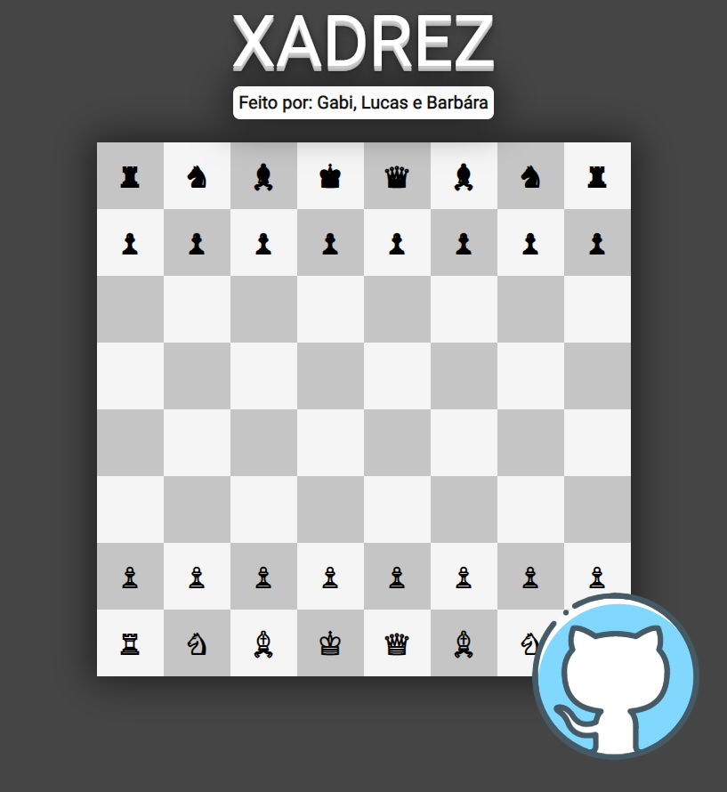

# __Xadrez__

Projeto solicitado por professor para ser realizado em grupo com o objetivo de criar um modelo do layout de tabuleiro de xadrez feito em React Unpkg

[🔗 Clique aqui para acessar](https://lucasats.github.io/Xadrez/)

## __🛠 Tecnologias__

## __Criadores__

|                                                                                                                                                    Autor                                                                                                                                                     |                                                                                                                                                    Autor                                                                                                                                                     |                                                                                                                                                    Autor                                                                                                                                                     |
| :-----------------------------------------------------------------------------------------------------------------------------------------------------------------------------------------------------------------------------------------------------------------------------------------------------------: | :-----------------------------------------------------------------------------------------------------------------------------------------------------------------------------------------------------------------------------------------------------------------------------------------------------------: | :-----------------------------------------------------------------------------------------------------------------------------------------------------------------------------------------------------------------------------------------------------------------------------------------------------------: |
| [ @Bamarcheti](https://github.com/Bamarcheti)     | [ @Espinoza9](https://github.com/Espinoza9)     | [ @LucasATS](https://github.com/LucasATS)     |
